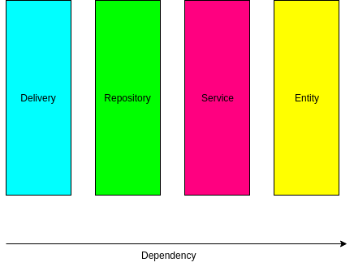
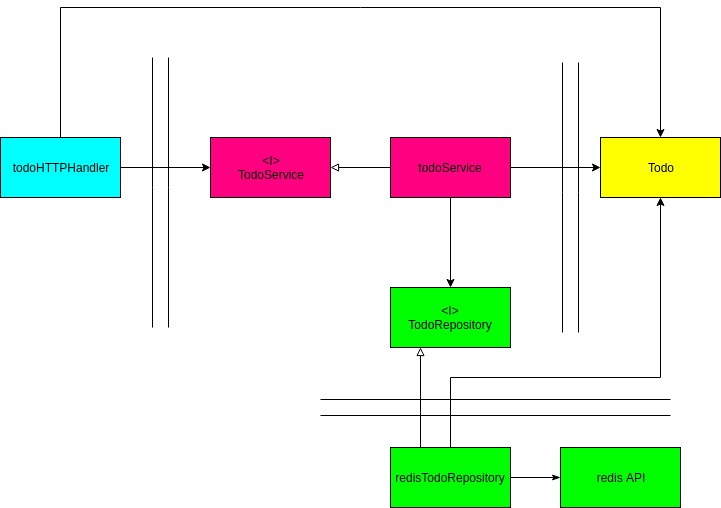

# Технологии

1. REST интерфейс для пользователя
2. Redis как база данных
3. Prometheus мониторинг
4. Docker контейнеризация
5. Echo web фреймворк

# Запуск

`docker-compose up`

# Юз кейсы

## Создание записи 
`curl -i 127.0.0.1:8080/todo -X POST -d '{"title": "abc"}' -H "Content-Type: application/json"`

обязательно передать `json` с полем `title` типа `string`

пример возвращаемого значения:
`{"id":1,"title":"abc","closed":false}`

## Получение всех записей
`curl -i 127.0.0.1:8080/todo -X GET`

пример возвращаемого значения:
`[{"id":1,"title":"abc","closed":false},{"id":2,"title":"abc","closed":false}]`

## Получение определенной записи
`curl -i 127.0.0.1:8080/todo/<id> -X GET`
где <id> - положительный `int` соответствующий id записи

пример возвращаемого значения:
`{"id":2,"title":"abc","closed":false}`

## Закрытие записи
`curl -i 127.0.0.1:8080/todo/<id> -X PUT`
где <id> - положительный `int` соответствующий id записи

т.к. существует единственный бизнес-кейс с данной сущностью, было принято решение работы с методом `PUT`. При увеличении кейсов, возможна декомпозиция REST метода

пример возвращаемого значения:
`{"id":2,"title":"abc","closed":true}`

##  Удаление записи
`curl -i 127.0.0.1:8080/todo/<id> -X DELETE`
где <id> - положительный `int` соответствующий id записи

В случае успешного выполнения запроса вернется HTTP ответ со статусом NoContent

## Метрики Prometheus
`curl -i 127.0.0.1:8080/metrics -X GET`

# Архитектура

В основе лежит принцип Clean Architecture.  Существующих слоев 4:
1. Слой бизнес-сущностей(entiry)
2. Слой бизнес-логики(service)
3. Слой работы с данными(repository)
4. Слой представления сервисов(delivery)

Такой подход позволяет гибко, быстро и безболезненно менять существующие слои(например, использовать другую базу данных, другой протокол общения) и менять используемые фреймворки. Также это упрощает тестирование. Добавление новых сущностей также может происходить отностиельно безболезненно.

Зависимости между слоями:

Зависимости между сущностями различных слоев(цвета соответствуют предыдущему изображению):

# База

Для простоты используется `HASH MAP`  Redis позволяющий хранить пары ключ-значение. Для общего счетчика используется интовое поле. Таким образом присутствует две сущности:
1. `id` для общего счетчика записей
2. `hm` для хранения сущностей. `{<id>: <объект сериализованный в json>}`

# Мониторинг

Prometheus. Для демонстрации возможностей используются следующие счетчики на кол-во ответов с соответствующим статусом:
1. `http_todo_response_status_ok`
2. `http_todo_response_status_not_found`
3. `http_todo_response_status_internal_server_error`

# Логирование

Два логирования:
1. `access.log` для http интерфейсов
2. `logs.log` для происходящих событий в приложении

# Контейнеризация

Создан докер образ для приложения.
Показан возможный вариант `docker-compose.yml` - опционально, можно включить и настроить сервер prometheys

# Тесты

Покрыто юнит тестами по слоям.
Для тестирования репозитория redis использована `github.com/rafaeljusto/redigomock`
Для тестирования сервисов созданы моки на интерфейс репозиториев при помощи `github.com/vektra/mockery`

# Развитие

1. Увеличить покрытие юнит-тестов
2. При добавлении сущностей в домен todo произвести рефакторинг(поменять названия директорий, пересмотреть интерфейсы, етц)
3. Отрефакторить `main.go`
4. Более тонкая настройка логирования
5. Расширенный мониторинг
6. Расширить интерфейс приложения увеличением поддерживаемых протоколов(т.е. добавить gRPC, NATS, WebSocket, етц)